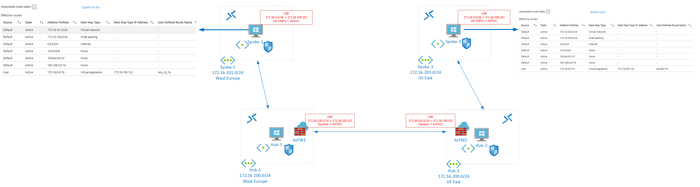

# Spoke-hub-hub-spoke via Azure Firewall

Demonstrates VNET-based spoke-hub-hub-spoke routing via Azure Firewall. 

Spoke VMs run a simple web server. 

To demonstrate connectivity:
- Log on to one of the Spoke VMs via Bastion: username AzureAdmin, password Firewall-2021.
- Browse from Spoke 1 to 172.16.203.4, and from Spoke 2 to 172.16.101.4. 
- Use tracert to see both firewalls in the path.

Hub VMs are provided as NVA routing alternatives to Azure Firewall, reconfigure the UDRs to route via these NVAs.

Azure Firewalls are configured via Policy.

